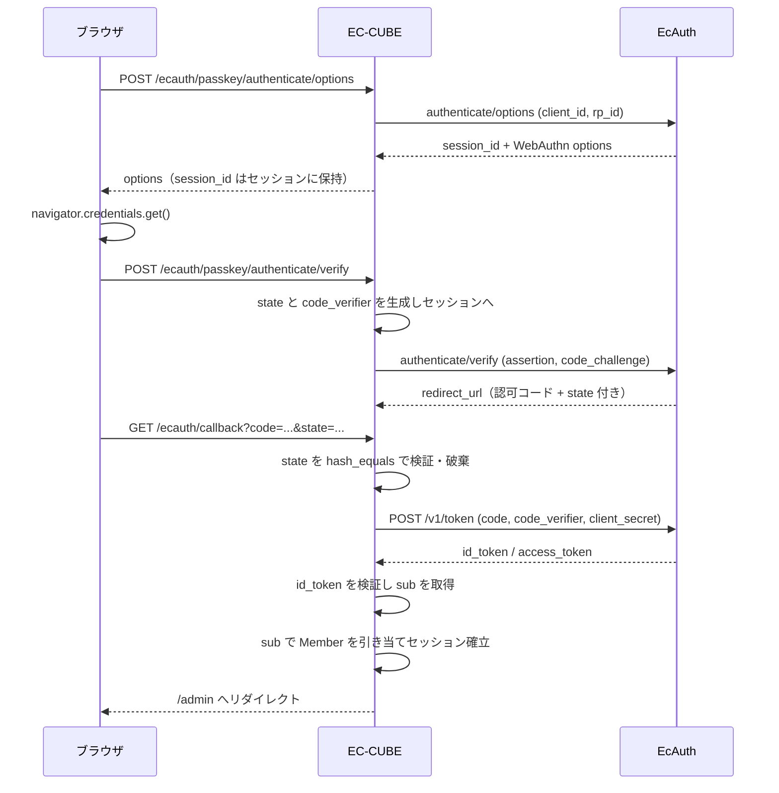

:::message alert
## 🙋‍♂️ EC-CUBE 開発・カスタマイズのお仕事、募集しています！

プラグイン開発・バージョンアップ・機能追加など、EC-CUBE に関することならお気軽にご相談ください。

👉 **[お問い合わせはこちら](https://a-zumi.net/contact/)**
:::

:::message
この記事は EC-CUBE 4.2/4.3 系を対象としています。
また、[Claude Code](https://claude.ai/claude-code) を使って書かれています。内容に誤りがある場合はコメントでお知らせください。
:::

EC-CUBE の管理画面は、初期状態だと ID とパスワードだけで入れます。`/admin` を推測されて総当たりされる話は昔からありますし、本体には2段階認証もあります。それでもパスワードを打つという行為自体は残ったままです。フィッシングサイトに ID とパスワードとワンタイムコードを丸ごと入力させられたら、そこで終わります。

その手前を潰すのがパスキー（WebAuthn/FIDO2）です。秘密鍵は端末から出ず、しかもクレデンシャルはドメインに紐づいているので、偽サイトでは署名そのものが作れません。

その EC-CUBE 向け実装が [EcAuth](https://ec-auth.io/) です。プラグインは [EcAuth/ec-cube4-ecauth](https://github.com/EcAuth/ec-cube4-ecauth) で LGPL-2.1 で公開されていて、中身が全部読めます。読んでみたら、パスキーの話というより **「EC-CUBE に外部 IdP をつなぐと何を踏むか」の実例集** になっていました。この記事はその読書メモです。

**TL;DR**

- EcAuth は EC-CUBE 管理画面向けのパスキー認証サービス。IdP 側は SaaS で、EC-CUBE 側にプラグインを入れて OAuth2/OIDC でつなぐ
- 現在の対応は 4.2 系 / 4.3 系（と 2.17 系 / 2.25 系）。4.4 系は開発予定
- プラグイン側は `EntityExtension` で `dtb_member` に `ecauth_subject` を UNIQUE 付きで生やし、`TemplateEvent` でログイン画面にボタンを差し込む。ここは普通
- 面白いのはその先。**コールバックで `TokenStorage::setToken()` を呼ぶと、管理者としてログインした結果フロントの会員がマイページに入れなくなる**
- ID Token は自前で検証している。RS256 固定、`iss` 完全一致、`aud` に加えて `azp`、`exp` 必須、JWKS は PSR-6 キャッシュ + `kid` 不一致時だけ強制再取得

## EcAuth とは何か

[ec-auth.io](https://ec-auth.io/) が提供している、EC-CUBE 管理画面向けのパスキー認証サービスです。OAuth2 / OpenID Connect ベースの Identity Provider が SaaS として動いていて、EC-CUBE 側にはプラグインを入れて連携します。Touch ID、Windows Hello、セキュリティキーが使えます。

ロードマップは4段階で公開されています。

| フェーズ | 内容 | 状態 |
| --- | --- | --- |
| Phase 1 | B2B パスキー認証（管理画面） | 提供中 |
| Phase 2 | B2C パスキー認証（フロント会員） | 計画中 |
| Phase 3 | ソーシャルログイン | 計画中 |
| Phase 4 | 企業 SSO | 計画中 |

つまり今回動くのは管理画面のログインだけで、フロントの会員ログインはまだです。対応バージョンは 4.2 系 / 4.3 系、それと 2 系（2.17 / 2.25）。**4.4 系は「開発予定」の欄にいます**。料金は5ユーザーまで無料と書かれていますが、ここは変わりうるので導入前にサイトを見てください。

EC-CUBE 以外の自社開発サイトからも使える、という位置づけになっています。実体が OIDC の IdP なので当然といえば当然です。

## 入れて動かすまで

オーナーズストアからインストールするか、composer で入れます。

```bash
bin/console eccube:composer:require ec-cube/ecauthlogin43
bin/console eccube:plugin:enable --code=EcAuthLogin43
```

有効化したら **設定 > EcAuth 設定** で Client ID と Client Secret を入れて保存します。Base URL は Client ID から自動で解決されるので、通常は入力不要です（後述する `ClientResolveService` が引きに行きます）。

ひとつ実務的な注意があって、**WebAuthn は HTTPS 必須**です。プラグインもそこは割り切っていて、ログイン画面のボタンは JS 側でこう判定してから生やしています。

```js
if (location.protocol !== 'https:' || typeof window.PublicKeyCredential === 'undefined') {
    return;
}
```

`http://localhost` での開発は WebAuthn の仕様上 secure context 扱いなのでブラウザ側は通りますが、このプラグインは `location.protocol` を見ているのでボタンが出ません。リポジトリの docker-compose が `https://localhost:4430` を向いているのはそのためです。

## 認証フローを追う

ログインボタンを押してから管理画面に入るまでを追います。登場人物はブラウザ、EC-CUBE、EcAuth の3者です。



認可コードフローそのものです。ポイントは、**`session_id` も `state` も `code_verifier` も、ブラウザには一度も渡さない**こと。JS が触るのは WebAuthn の options と assertion だけで、フローの状態はすべて PHP のセッションに置かれます。`client_secret` も当然サーバーサイドのみです。

PKCE も自前で組んであります。

```php
public function generateCodeVerifier(): string
{
    return $this->base64UrlEncode(random_bytes(32));
}

public function generateCodeChallenge(string $codeVerifier): string
{
    return $this->base64UrlEncode(hash('sha256', $codeVerifier, true));
}
```

`hash()` の第3引数のコメントが実装者の傷跡という感じで良いです。

> `hash()` の第3引数 (raw binary) を落とすと hex 文字列をエンコードした別物になり、EcAuth 側は形式を検証しないためトークン交換まで失敗が露見しない。

## プラグインとしての作り

ここまでは普通の EC-CUBE プラグインです。

**Member への列追加**は `EntityExtension` の trait。4.2/4.3 系なのでアノテーションです。

```php
/**
 * @EntityExtension("Eccube\Entity\Member")
 */
trait MemberTrait
{
    /**
     * @ORM\Column(name="ecauth_subject", type="string", length=255, nullable=true, unique=true)
     */
    private $ecauth_subject;
}
```

`unique=true` が効いています。この列は EcAuth 側の `sub` と 1:1 で、しかも後述するとおり**この値で Member を引いて管理者セッションを張る**ので、重複したら他人としてログインできてしまう。DB 制約で物理的に不可能にしてあります。

**ログイン画面へのボタン追加**は `TemplateEvent` ですが、`addSnippet()` ではありません。

```php
public function onAdminLoginTwig(TemplateEvent $event)
{
    $event->setParameter('ecauth_auth_js_version', $this->authJsVersion);
    $source = $event->getSource();
    $source .= '';
    $event->setSource($source);
}
```

理由はコメントのとおりで、管理画面のログイン画面は `login_frame.twig` を継承していますが、この親テンプレートは `plugin_snippets` を描画しません。4.3 の `login_frame.twig` を見ると、あるのは空の `` だけ。そして `login.twig` 側は `` しか定義していないので、**ソースに `` を後ろから足せば親の穴に入る**わけです。管理画面の他のページと同じ感覚で `addSnippet()` を書くと無言で消えます。

**レートリミット**は、プラグインの `services.yaml` から本体の設定に相乗りしています。

```yaml
eccube:
    rate_limiter:
        ecauth_passkey_authenticate:
            route: ecauth_passkey_authenticate_options
            method: ['POST']
            type: ['ip']
            limit: 10
            interval: '60 minutes'
```

`Eccube\DependencyInjection\Configuration` の `rate_limiter` は `limiters` キーが無ければ配列全体を `limiters` とみなす `beforeNormalization()` が入っているので、この平たい書き方で通ります。プラグイン側から本体のレートリミッタを増やせるのは知らなかったので、これは持ち帰りです。

## `setToken()` を呼ばない理由

ここからが読んで良かった部分です。

認証が済んで Member を引き当てたあと、普通なら Symfony の作法で `TokenStorage::setToken()` を呼びたくなります。このプラグインはそうしません。

```php
$session->migrate(true);
$token = new UsernamePasswordToken($Member, 'admin', $Member->getRoles());
$session->set('_security_admin', serialize($token));
```

セッションキーに直接 serialize したトークンを書き込んでいます。一見すると行儀が悪い。でも [#45](https://github.com/EcAuth/ec-cube4-ecauth/issues/45) のコメントを読むと、これしかないことが分かります。

コールバック URL は `/ecauth/callback` です。EC-CUBE の admin ファイアウォールの pattern は `^/%eccube_admin_route%/` なので、**このURLは admin ファイアウォールにマッチしません**。`^/` の customer ファイアウォール配下で処理されます。

その状態で `TokenStorage` に Member を載せると何が起きるか。

1. レスポンス時に customer ファイアウォールの `ContextListener::onKernelResponse()` が、TokenStorage の中身を自分のセッションキーへ書き出す
2. `_security_customer` に Member のトークンが入る
3. `ContextListener` にはファイアウォール個別ではなく全 user provider が渡るので、以降のフロントリクエストで `MemberProvider` が `refreshUser()` に成功してしまう
4. 「ログイン済みだが `ROLE_USER` を持たないユーザー」としてセッションが復元される
5. `/mypage/login` はログイン済み判定でログインフォームを出さず `/mypage/` へリダイレクトし、`/mypage/` は `access_control` の `ROLE_USER` を満たさず Access Denied

つまり **管理者がパスキーでログインすると、そのブラウザの一般会員がマイページに入れなくなる**。管理者の認証処理が会員側の認証を壊す、というかなり分かりにくい壊れ方です。

`_security_admin` に直接書けば、リダイレクト先の `/admin` へのリクエストで admin ファイアウォールの `ContextListener` が正しくトークンを復元するので、管理者ログインだけが成立します。プラグインの CLAUDE.md には「『Symfony の作法に合わせる』等の理由で `setToken()` に戻さないこと」と釘まで刺してあり、Playwright に `#45:` で始まるリグレッションテストも置かれています。

フロントと管理画面、どちらのファイアウォールにも属さない URL を作ると、この地雷を踏みます。決済プラグインのコールバックも同じ位置にあることが多いので、他人事ではありません。

## ID Token 検証の中身

`sub` は Member の引き当てに直結します。ここを疑わずに使うと、他人の管理者セッションを作れてしまう。というわけで `IdTokenVerifier` が 455 行あります。JWT ライブラリを引かず、素の PHP で書かれています。

やっていることを並べると、

1. ヘッダの `alg` が `RS256` であること（`hash_equals` で比較。`alg=none` や HS256 へのすり替えを拒否）
2. JWKS の公開鍵で RS256 署名を検証
3. `iss` が設定済み Base URL と**完全一致**すること
4. `aud` に自分の `client_id` が含まれること、`azp` があればそれも自分であること
5. `exp` が存在し、有効期限内であること（**`exp` が無いトークンは拒否**）
6. `nbf` / `iat` があれば未来でないこと

3の完全一致にはコメントが付いています。

> 末尾スラッシュ等を吸収してしまうと、末尾スラッシュだけが異なる別 issuer のトークンを受け入れてしまう。

4の `azp` も効きます。OIDC Core 3.1.3.7 の (4)(5) をそのまま実装したもので、これが無いと **別クライアント向けに正当に発行されたトークンを使い回して管理者セッションを張れる**。`aud` に自分が入っていれば通す実装をよく見ますが、あれは足りていません。

JWK から公開鍵を作るところは、PHP に標準関数が無いので DER を手で組んでいます。

```php
/**
 *   SEQUENCE {
 *     SEQUENCE { OBJECT IDENTIFIER rsaEncryption, NULL }
 *     BIT STRING { SEQUENCE { INTEGER n, INTEGER e } }
 *   }
 */
private function rsaPublicKeyToPem(string $modulus, string $exponent): string
```

DER の INTEGER は符号付きなので最上位ビットが立っていたら `0x00` を前置する、長さは127バイト以下なら短形式、といった処理まで自前です。`firebase/php-jwt` を足せば済む話ではありますが、プラグインの依存を増やさない判断としては理解できます（このプラグインの `require` は PSR 系5つと `ec-cube/plugin-installer` だけです）。

JWKS のキャッシュも作り込まれていました。本体の `cache.app`（PSR-6）に 300 秒で載せ、`kid` に一致する鍵が見つからないときだけ強制再取得します。ただし強制再取得には60秒のクールダウンがあって、鍵が見つからないリクエストが殺到しても JWKS エンドポイントを叩き続けないようになっています。

## Base URL を許可リストで縛る

`ecauth_base_url` はトークン交換先であり、JWKS の取得先でもあります。ここが攻撃者のホストに向けば、**署名検証ごと攻撃者の鍵で成立します**。検証がまるごと無意味になる。

そこで `BaseUrlValidator` が既定で `.ec-auth.io` サブドメインのみを許可します。設定画面から入力された値も、`ClientResolveService` が API から取ってきた値も、両方ともこのバリデータを通ります。

```php
if (isset($parts['user']) || isset($parts['pass'])) {
    return null;
}
if (isset($parts['path']) && $parts['path'] !== '') {
    return null;
}
```

`https://evil@ec-auth.io` のような認証情報付き URL も、パスやクエリが付いた URL も弾きます。ポートの扱いも細かくて、`.ec-auth.io` と書いたエントリは既定ポート（443）だけを許可し、`https://tenant.ec-auth.io:8443` は通しません。省略を任意ポート許可の意味に取ると、許可ホスト上の別サービスまで信頼の内側に入ってしまうからです。

docblock には運用への注意も書かれています。

> `.azurewebsites.net` のような共有ホスティングのサフィックスを許可すると、そのサービスの全利用者（＝無関係な第三者）を信頼することになり、この検証の意味が失われる。

環境変数 `ECAUTH_ALLOWED_HOSTS` で上書きできるので、自前のステージング環境を使うときはここに完全なホスト名を足す形になります。許可リストが空なら全拒否（fail-closed）です。

## テナントを切り替えると全部壊れる、という罠

これはこのプラグイン固有の話ですが、他の SaaS 連携でも似た形で出てくると思うので書いておきます。

EcAuth の `B2BUser.Subject` は Organization をまたいでグローバル一意です。一方プラグインは、`dtb_member.ecauth_subject` に値があれば無条件で再利用します。

すると、**テスト用テナントの Client ID で試したあと本番用に差し替えると、別 Organization に同じ subject を登録しようとして `register/options` が必ず 400 になる**。エラーメッセージからは原因が読み取れません。

対処は、設定画面で Client ID の新旧を比較して、変わっていたら全 Member の `ecauth_subject` をクリアする（[#52](https://github.com/EcAuth/ec-cube4-ecauth/issues/52)）。判定は `TenantChangePolicy` という EC-CUBE 非依存のクラスに切り出され、ユニットテストで固定されています。「誤ると全管理者のパスキーを巻き添えでクリアする方向に倒れる」ロジックなので、当然の分離です。

ここで踏まれているのが**フォームは managed entity に直接バインドされる**という点。

```php
$previousClientId = $Config !== null ? (string) $Config->getClientId() : '';

$form = $this->createForm(ConfigType::class, $Config);
$form->handleRequest($request);
```

`ConfigRepository::get()` が返すのは Doctrine の管理対象エンティティで、それをそのまま `createForm()` に渡しています。したがって **`handleRequest()` を通った瞬間、`$Config->getClientId()` は入力値になっています**。保存前の値が欲しければ `handleRequest()` より前に退避しておくしかない。設定を配列で持つ 2 系から移植するときに一番間違えやすい、とプラグインの CLAUDE.md にも書かれていました。

逆に、バリデーションエラーで `flush()` せずに return する経路が副作用を残さないのは、EC-CUBE の `TransactionListener` が commit するだけで flush はしないからです。これも言われないと気づきません。

## 細かいけど刺さる話

読んでいて「これは自分もやる」と思ったものを2つ。

**`json_decode($str, true)` は JSON の `{}` を PHP の `[]` にする。**

```php
if (array_key_exists('clientExtensionResults', $response)
    && is_array($response['clientExtensionResults'])
    && empty($response['clientExtensionResults'])) {
    $response['clientExtensionResults'] = new \stdClass();
}
```

WebAuthn の `clientExtensionResults` は常にオブジェクトですが、空だと連想配列と区別が付かず、`json_encode` で JSON 配列 `[]` として送り返されます。EcAuth 側は .NET の Fido2.NetLib なので、型が合わずデシリアライズが落ちる。PHP から他言語の API を叩くときの定番の踏み方です。

**`form_widget` の `attr` に `id` を渡しても上書きされない。**

`{{ form_widget(form.foo, { attr: { id: 'my-id' } }) }}` と書くと、Symfony が出力する `id="form_foo"` は消えず、`id` 属性が2つ並びます。HTML パーサは先勝ちなので後ろは無視され、`getElementById('my-id')` は `null` を返す。JS が静かに何もしなくなります。テンプレートから要素を掴むなら `{{ form.foo.vars.id }}` を使え、というのが結論。

## 導入を検討するなら

現状の整理です。

- **4.4 系はまだ**。ロードマップでは開発予定になっています。4.4 でパスキーを前提にした構成は今は組めません
- **HTTPS 必須**。ローカル開発でも証明書を用意する必要があります
- **フロント会員のパスキーは Phase 2**。今入れられるのは管理画面だけです
- IdP は SaaS なので、**EcAuth 側が落ちたらパスキーでは入れません**。パスワードログインは無効化されないので締め出されはしませんが、そのぶん「パスワードを廃止する」ところまでは行けません
- パスキー未登録の管理者がログイン画面のボタンを押すと `NotAllowedError` になります。ログイン画面では誰がログインするか未確定なので `b2b_subject` を送らず、EcAuth が組織内の全クレデンシャルを `allowCredentials` に詰めて返す設計だからです。以前は握り潰していて「押しても何も起きない」ように見えていた、という [#58](https://github.com/EcAuth/ec-cube4-ecauth/issues/58) の経緯があり、今は案内が出ます

管理画面の認証を一段固めたい案件で、4.2/4.3 系なら十分に選択肢に入ると思います。

## 読んでみて

パスキーの処理そのものは EcAuth 側の SaaS がやってくれます。プラグインに残る仕事は、OIDC のクライアントとして正しく振る舞うことと、その結果を EC-CUBE のセッションに正しく着地させることの2つだけ。そしてその2つが、どちらもきれいに難しい。

とくに `TokenStorage::setToken()` の話は、EC-CUBE でファイアウォール外のコールバック URL を作る人全員に関係します。決済プラグインのコールバックや Webhook の受け口が全部これです。書き方を間違えても管理者ログイン自体は成功するので、**会員から「マイページに入れない」と言われるまで気づけない**タイプのバグです。

ソースは全部読めます。リポジトリの `CLAUDE.md` に「踏みやすい罠」が実例付きでまとまっているので、EC-CUBE で外部連携プラグインを書く予定があるなら、そこだけでも読む価値があります。

- プラグイン: https://github.com/EcAuth/ec-cube4-ecauth
- サービス: https://ec-auth.io/

---

## 📩 EC-CUBE開発・カスタマイズのご相談

以下のような案件、お気軽にご相談ください。

- プラグイン開発・既存プラグインの改修
- EC-CUBE 4系へのバージョンアップ対応
- カスタマイズ・機能追加

👉 **[お問い合わせはこちら](https://a-zumi.net/contact/)**

---
