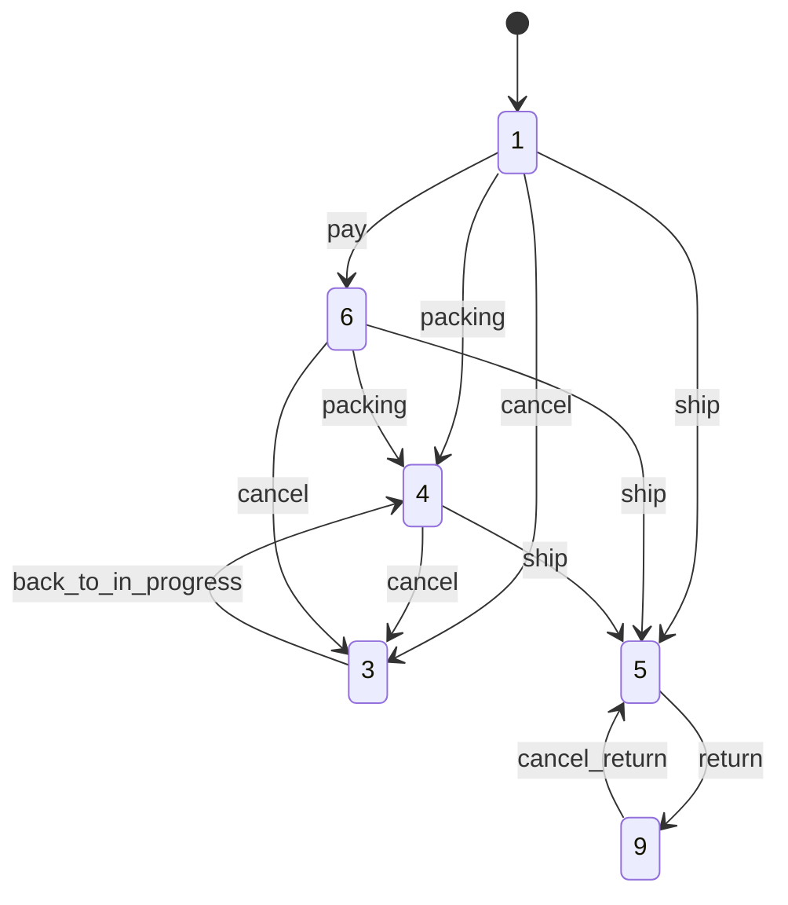

# EC-CUBEの受注ステータス遷移図、コードを読まずに1コマンドで確認できる【workflow:dump】

> この記事は EC-CUBE 4.3 以上を対象としています。
> また、[Claude Code](https://claude.ai/claude-code) を使って書かれています。内容に誤りがある場合はコメントでお知らせください。

EC-CUBEの受注ステータスを「キャンセル」に遷移させたのに、在庫が戻っていない——そんな経験はありませんか？

実は EC-CUBE の受注ステータス管理は **Symfony Workflow コンポーネント**で厳密に制御されており、「どの遷移で在庫が戻るか」「どの遷移でポイントが付与されるか」はすべてビジネスロジックとして定義されています。

これを知らないままカスタマイズすると、想定外の状態遷移でデータ不整合が起きます。これを防ぐ最短の方法が **`workflow:dump` コマンド**です。EC-CUBE 4.3 環境ならば今すぐ使えます。

> **この記事のポイント（TL;DR）**
> - EC-CUBEの受注ステータス管理はSymfony Workflowで実装されている
> - `php bin/console workflow:dump order` で状態遷移図（Graphviz/PlantUML/Mermaid）を出力できる
> - Symfony 8.1（PR #63809）では `--with-listeners` でイベントリスナーも図に含められる予定

## EC-CUBEの受注ステータスはSymfony Workflowで管理されている

EC-CUBE 4.3 の受注ステータス管理は、Symfonyの **Workflowコンポーネント**（`symfony/workflow: ^6.4`）を使って実装されています。

定義ファイルは `app/config/eccube/packages/order_state_machine.php`、実装クラスは `src/Eccube/Service/OrderStateMachine.php` です。

### 受注ステータスの状態（Places）

| 定数 | 値 | 日本語名 |
|---|---|---|
| `OrderStatus::NEW` | 1 | 新規受付 |
| `OrderStatus::CANCEL` | 3 | 注文取り消し |
| `OrderStatus::IN_PROGRESS` | 4 | 対応中 |
| `OrderStatus::DELIVERED` | 5 | 発送済み |
| `OrderStatus::PAID` | 6 | 入金済み |
| `OrderStatus::PENDING` | 7 | 決済処理中 |
| `OrderStatus::PROCESSING` | 8 | 購入処理中 |
| `OrderStatus::RETURNED` | 9 | 返品 |

初期状態（`initial_marking`）は **新規受付（1）** です。

### 受注ステータスの遷移（Transitions）

| 遷移名 | 遷移元 | 遷移先 |
|---|---|---|
| `pay` | 新規受付 | 入金済み |
| `packing` | 新規受付、入金済み | 対応中 |
| `cancel` | 新規受付、対応中、入金済み | 注文取り消し |
| `back_to_in_progress` | 注文取り消し | 対応中 |
| `ship` | 新規受付、入金済み、対応中 | 発送済み |
| `return` | 発送済み | 返品 |
| `cancel_return` | 返品 | 発送済み |

---

## workflow:dump コマンドで状態遷移図を出力する

Symfony には `workflow:dump` コマンドが標準で搭載されています。EC-CUBE 4.3 の環境でそのまま使えます。

```bash
php bin/console workflow:dump order

php bin/console workflow:dump order --dump-format=puml

php bin/console workflow:dump order --dump-format=mermaid

php bin/console workflow:dump order 6
```

### Graphviz（dot形式）の出力を画像にする

dot形式の出力はGraphvizをインストールすることで画像に変換できます。

```bash
php bin/console workflow:dump order | dot -Tpng -o order_workflow.png

php bin/console workflow:dump order | dot -Tsvg -o order_workflow.svg
```

### Mermaid形式でそのまま確認する

Mermaid形式はGitHubのMarkdownや各種ドキュメントツールで直接レンダリングできます。

```bash
php bin/console workflow:dump order --dump-format=mermaid
```

出力例：



### --with-metadata オプション

メタデータ付きで出力することもできます。

```bash
php bin/console workflow:dump order --with-metadata
```

---

## 各遷移で何が起きるか：OrderStateMachine のイベントリスナー

状態遷移が起きるとき、`OrderStateMachine` クラス（`EventSubscriberInterface` を実装）が各遷移に対応したイベントを処理します。

| イベント | 処理内容 |
|---|---|
| `workflow.order.completed` | 受注エンティティのステータスを再設定 |
| `workflow.order.transition.pay` | 入金日を現在日時に設定 |
| `workflow.order.transition.cancel` | 在庫を戻す、利用ポイントを戻す |
| `workflow.order.transition.back_to_in_progress` | 在庫を減らす、利用ポイントを消費 |
| `workflow.order.transition.ship` | 加算ポイントを会員に付与 |
| `workflow.order.transition.return` | 利用ポイント・加算ポイントを戻す |
| `workflow.order.transition.cancel_return` | 利用ポイント・加算ポイントを再適用 |

これを見るだけで「`ship`（発送済みへの遷移）でポイントが付与される」「`cancel`（取り消し）で在庫とポイントが戻る」という重要なビジネスロジックがわかります。

---

## Symfony 8.1 で来る変化：`--with-listeners` オプション（PR #63809）


Symfony PR [#63809](https://github.com/symfony/symfony/pull/63809) では、`workflow:dump` に `--with-listeners` オプションが追加される予定です。

```bash
php bin/console workflow:dump order --with-listeners | dot -Tpng -o order_workflow.png
```

このオプションを使うと、Graphviz図の各遷移ノードに対応するイベントリスナーが表示されます。

**変更の概要（PR #63809のdiffより確認）:**

- `WorkflowDumpCommand` に `--with-listeners` オプション（フラグ型）を追加
- `ListenerExtractor::extractListeners()` でリスナーを取得
- `GraphvizDumper` がリスナーを遷移ノードに `"Listener #N"` として表示
- Guard リスナーは `"Guard: <expression>"` として表示

EC-CUBEに当てはめると、`ship` 遷移のノードに「加算ポイントを付与する `commitAddPoint` リスナー」が図に表示されるイメージです。

### EC-CUBEでこれが使えると何が嬉しいか

現状、EC-CUBEの受注処理のどのタイミングで何が起きるかを把握するには `OrderStateMachine.php` を読む必要があります。`--with-listeners` が使えるようになると：

- **新しいメンバーへの引き継ぎ**に状態遷移図をそのまま使える
- **プラグインのリスナー追加時**に「どの遷移に何が紐づいているか」を一目で確認できる
- **カスタマイズの影響範囲**を図で説明できる

---

## まとめ

| | 内容 |
|---|---|
| 今すぐ使えること | `workflow:dump order` で状態遷移図をdot/PlantUML/Mermaid形式で出力 |
| EC-CUBEのワークフロー定義 | `app/config/eccube/packages/order_state_machine.php` |
| EC-CUBEのリスナー実装 | `src/Eccube/Service/OrderStateMachine.php` |
| Symfony 8.1以降（予定） | `--with-listeners` でリスナーも図に含められる（PR #63809） |

受注周りのカスタマイズをするときは、まず `workflow:dump` で状態遷移を確認する習慣をつけると、コードを追いかける時間を大幅に減らせます。

みなさんの EC-CUBE カスタマイズで「この遷移でこんな副作用があった」という経験があれば、ぜひコメントで教えてください。

---

## 📩 EC-CUBE開発・カスタマイズのご相談

以下のような案件、お気軽にご相談ください。

- プラグイン開発・既存プラグインの改修
- EC-CUBE 4系へのバージョンアップ対応
- カスタマイズ・機能追加
- エンタープライズ向け開発・導入支援

👉 **[お問い合わせはこちら](https://a-zumi.net/contact/)**

---